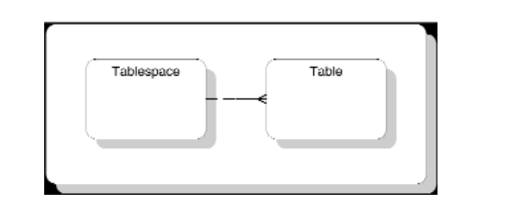
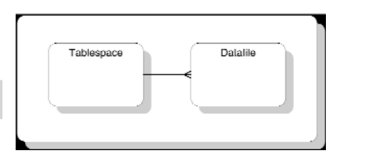
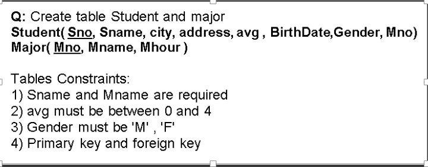
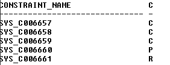
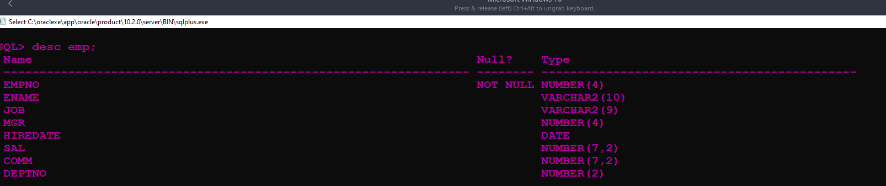
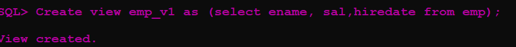
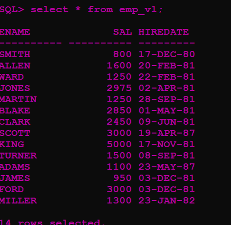
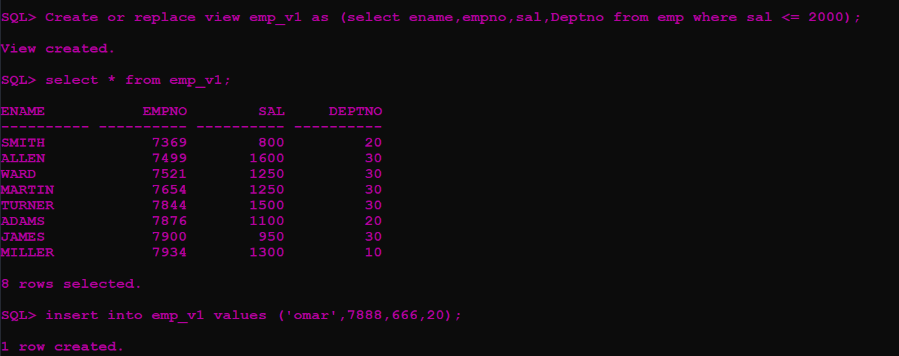
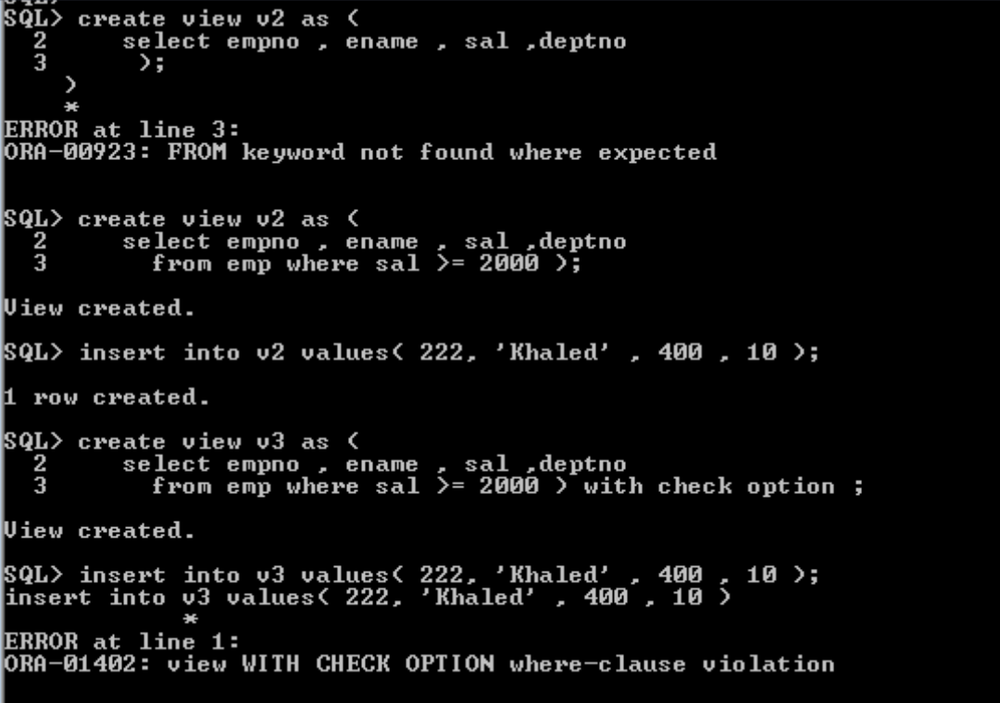
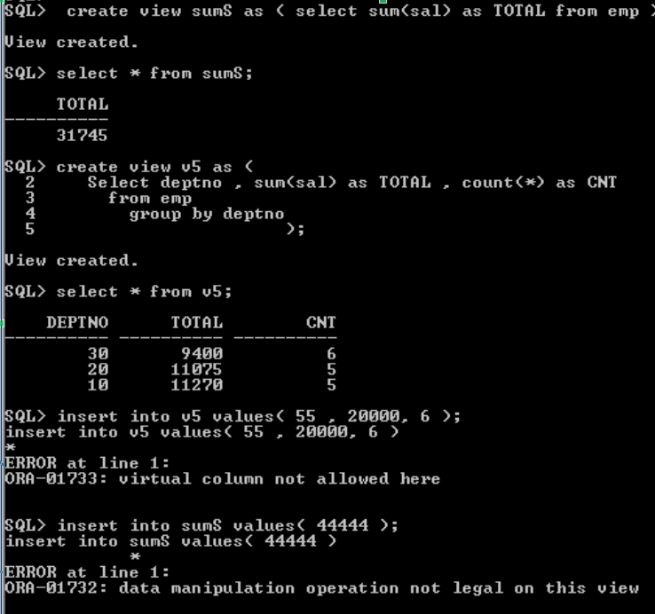

# DBA Review
Note: 🔥 == important

## *What is Database ?*
A set of logically related data with a description. 
## *What is DBA ?* 🔥
**Database administration** is the process of establishing computerized databases, and insuring their ``recoverability``, ``integrity``, ``security``, ``availability``,``reliability``, and ``performance``.

## *What is DBMS ?* 🔥
The software that manages the access to the database.it enables users to *define, create, and maintain* the database and provides controlled access to it.
>- Define = DDL (Database Definition Language)
>-  Create = DML (Database Manipulation Language)
>-  Maintenance = (DCL/TCL)  like security, integrity, concurrency control, recovery control, and user-accessible catalog.


## The History of DBMS

### *First Generation DBMS*
- Hierarchical Model
- Network Model

### *Second Generation DBMS*

- relational model
- The extended relational model

### *Third Generation DBMS*
- Object Oriented DBMS and Object-Relational DBMS

## *Advantages of DBMSs* 
1.  Control of Data Redundancy
2. Data Consistency
3. Economy of scale
4. Sharing of data
5. Improved data integrity
6. Improved security
7. Improved Backup and Recovery Services
8. Increased Productivity
9. Increased Concurrency 
10. Improved Data Accessibility and Responsiveness

## *Disadvantages*
1. Complexity
2. Size
3. Cost

## Functions of a DBMS
<mark>**Data storage, retrieval, and update**</mark>

	A DBMS must provide users with the ability to store, retrieve, and update data in the database.  It should hide the internal physical implementation details from users

<mark>**A user-accessible catalog**</mark>

	A DBMS must provide a catalog in which descriptions of data items are stored and which is accessible to users.

**Transaction Support**

<mark> A DBMS must furnish a mechanism that will ensure that either all updates corresponding to a given transaction are made or that none of them is made.</mark>  This is to prevent the database being in an inconsistent state.  A transaction is a series of actions, carried out by a single user, or a program that access or changes the contents of the database.

**Concurrency Control Services** 🔥

	  A DBMS must furnish a mechanism **to ensure that the database is updated correctly when multiple users are updating the database concurrently**

**Recovery services**

   A DBMS must furnish a mechanism for recovering the database in the event that the database is damaged in any way.

**Security services**

    A DBMS must furnish a mechanism to ensure that only authorized users can access the database.
	
**Support for data communication** 

    A DBMS must be capable of integrating with communication software.


**Integrity services**

	A DBMS must furnish a means to ensure that both the data in the database and changes to the data follow a certain rules.

**Services to promote data independence**  
   
    DBMS must include facilities to support the independence of programs from the actual structure of the database.

**Utility services**
	  
    A DBMS should provide a set of utility services. These are tools to help the DBA to administer the database effectively, such as import facilities, monitor facilities, statistical analysis programs, index reorganization facilities, and many others.

## *Some Definitions*      

🔥 **The system Catalog** It is called sometime DATA DICTIONARY the catalog stores data about the data (meta-data). 

**Recovery** Restore the DB to the consistent state after the event of failure.

**Integrity** Data and update on data should follow the constraints (rule)


## *What are the components of the DBMS Environment*
- Hardware
- Software
- Data 
- Procedures
- People  (Users) (Roles)

## Roles in the Database Environment DB USERS
- Database Administrators (DBA)
- Database Designers
- Application Programmers
- End-Users( Naïve , Sophisticated)


Responsibilities For different user types:

`Database Administrators (DBA)` 🔥

1. Manage Users( Create User , Grant and Revoke Privileges)
2. Defining Security & Integrity Checks 
3. Monitoring Performance 
4. Defining Backup / Recovery Procedures 
5. Setting System Parameters
6. Acquiring Hardware and Software 
7. Define DB Procedures , Triggers


`Database Designers`

1. Define DB Schema  (Structure , Types , Constraints)
2. Communicate with end user  and understand their needs


`Application Programmers`

N/A
 

`End-Users`: They are the clients for the database to serve their information needs.

- **Naïve users** : They do not need to know about the database;They access the database through simple application programs such as data entry.

- **Sophisticated users**: They are familiar with the **structure of the database and the functionality of the DBMS**.**They use high-level query language, such as SQL**.

### *DBA Responsibilities*:

**Defining the Schema**

The DBA defines the schema which contains the structure of the data in the application. The DBA determines what data needs to be present in the system ad how this data has to be represented and organized. 

**Liaising with Users**

The DBA needs to interact continuously with the users to understand the data in the system and its use. 

**Defining Security & Integrity Checks**

The DBA finds about the access restrictions to be defined and defines security checks accordingly. Data Integrity checks are also defined by the DBA.

**Defining Backup / Recovery Procedures**

The DBA also defines procedures for backup and recovery. Defining backup procedures includes specifying what data is to backed up, the periodicity of taking backups and also the medium and storage place for the backup data. 

**Monitoring Performance**

The DBA has to continuously monitor the performance of the queries and take measures to optimize all the queries in the application.

## *DBA Challenges*
- Ever Changing TechnologiGes
- Never ending requests
- Urgency of a client’s demands for  data
- Need to maintain a secure, yet available database environment

## What is a database view 🔥
A view is a subset of the database, presented to one user or set of users. 

## Mention the benefits using views :
1. They <mark>reduce complexity</mark> by letting users see the data in the way they want
2. They <mark>provide security</mark> by excluding data that some users should not see
3. They <mark>customize the appearance of the database</mark>, such as changing attribute names
4. They <mark>hide changes in the database and provide consistent view of the database to users.</mark>  
5. The also provide the program-data independence mentioned earlier .

## Table Spaces 
- What a Tablespace Is ? 🔥

A tablespace is a database construct that is realized by one or more files called “datafiles.” Data is not physically stored in a tablespace. It is stored in one or more datafiles.


Oracle divides a database into one or more logical storage units called tablespaces.

🔥Each **tablespace** <mark>consists of one or more files called</mark> **datafiles**. A **datafile**<mark> physically stores the data objects of the database</mark> such as tables and indexes on disk. 

In other words, Oracle logically stores data in the tablespaces and physically stores data in datafiles associated with the corresponding tablespaces.


A datafile can span multiple disks. The size of a
datafile is initially determined by the DBA upon creation. It can be as large as the largest file permitted by the operating system. The configuration of the machine on which the database is running determines
exactly how the information in the datafile is distributed across the disk.



-  What Tablespaces used for ?


    - Control the storage size allocated for the database data.
    - Grant specific space quotas to the database users.
    - Control the availability of data by taking tablespaces online or offline (more on this later).
    - Improve the performance of the database by allocating data storage across devices.
    - Perform partial database backup or recovery.
	- configure the database such that database objects are separated, to reduce the amount of administration and physical disk I/O (input/output) necessary.
    - DBA ensure that problem areas will remain isolated and will not affect the entire database because of the use of tablespaces.

- Default tablespaces in Oracle

  -  The `SYSTEM` and `SYSAUX tablespaces store system-generated objects such as data dictionary tables. And you should not store any object in these tablespaces.
  - The `USERS` the USERS tablespace is used as the default tablespace for all users who have been granted permission to create objects such as tables and indexes.
  - The `RBS` holds the undo data The RBS tablespace is used for rollback segments.
  - The `TEMP` is the temporary tablespace which is used for storing intermediate results of sorting, hashing, and large object processing operations.
  - The `INDX` tablespace is used to store index data. 


- Tablespaces status 

  A tablespace can have one of two statuses: `ONLINE` or `OFFLINE`. When a tablespace is online, it is available to the database Instance. For example, data may be read from the datafiles associated with an online tablespace. When a tablespace is offline, it is not available for such activity.

- TableSpaces and Datafiles

 

The relationship of tablespaces to `datafiles` in that `tablespaces` are logical space management structures that are composed of one or more disk or physical files. Oracle refers to these physical files as datafiles,
the files that hold the physical data contained in the objects in the tablespaces.
Again, one single tablespace can be composed of one or more datafiles.

## **Practical** 
## SQL Recap 

 

### Important SQL Oracle Data Types to remember:

 Oracle supplies the following built-in datatypes:

**`Character` datatypes**
* ``CHAR`` (size) Fixed-length character data of length size bytes
* ``(VARCHAR2 and VARCHAR) + (size)`` Variable-length character data.  

 **``NUMBER`` datatype** Variable-length numeric data. Maximum precision p and/or scale s is 38.  

 **``DATE`` datatype**  Fixed-length date and time data, ranging from Jan. 1, 4712 B.C.E. to Dec. 31, 4712 C.E.  

#### DML : 
```sql
insert into dept values(50,'Info Tech','Amman');

update emp set sal = 1000 , job = 'QA'
   where empno = 7369;

delete from emp where sal >= 2000;
```

#### DDL : 

```sql
alter table dept add office varchar2(40);

alter table dept modify office varchar2(60);

alter table dept drop column office;

alter table emp add constraint emp_sal_ck
      check(sal between 400 and 7000 ) ;

alter table emp disable constraint emp_sal_ck ;

alter table emp enable  constraint emp_sal_ck ;

alter table emp drop constraint emp_sal_ck;

Truncate table dept;

Drop table dept;
```


### How to create a User in oracle database
### ex: Create User (name: std4, password: s123) And Grant connect, resource to std4

```sql
Conn system/p2
Create user std4 identified by s123;
Grant connect,resource to std4;
```

Q: Connect with user std4 and Show all tables and views
 ```sql
 conn std4/s123
 Select * from tab;
```
### How to create a Table:


```sql 
Create table Major(
Mno number(5) primary key,
Mname varchar2(20) NOT NULL,
Mhour number(3)
);
```
```sql
Create table Student (
Sno number(10) primary key,
SName varchar(50) NOT NULL,
city varchar(15),
address varchar(100),
birhdate date,
gender char check (gender in ('M','F')),
Mno number(4),
avg number(2,3) check (avg between 0 and 4),
foreign key(Mno) References Major
);

/*If you started with the student Table you should not put the foreign key statement because the major table dose not exist yet you can create the student table first then the major table then Alter the student table with this statement*/
Alter Table Student Add Constraint Mno_fk foreign key(mno) References major(mno);
```
If there is any SQL Syntax that you don't understand you do't understand : 
visit this site [Oracle Tutorial](https://www.oracletutorial.com/getting-started/)

### How to Display Constraints for table student? 🔥 🔥
You need to use the user dictionary 
```sql
Select Constraint_name,status Form user_constraints where table_name 'STUDENT';
```
The Results :



To Make those constraints more readable you can rename them by altering the table with something like this:

```sql
Alter table student rename constraint SYS_C004081 to sno_pk;
```
OR you consider that form before creating the table like this : 


```sql 
Create table Major(
Mno number(5) primary key,
Mname varchar2(20) NOT NULL,
Mhour number(3)
);
```
```sql
Create table Student (
Sno number(10) constraint Student_pk  primary key,
SName varchar(50) constraint Student_Name_nn NOT NULL,
city varchar(15),
address varchar(100),
birhdate date,
gender char constraint STD_gender_ck check (gender in ('M','F')),
Mno number(4),
avg number(2,3)constraint STD_AVG check (avg between 0 and 4),
constraint student_mno_fk foreign key(Mno) References Major
);
```
The Result: 


### How To create a view 🔥 🔥
 To create a new view in a database, you use the following Oracle 
 ```sql

CREATE OR REPLACE VIEW name AS  
SELECT column_1, column_2, column_3,......  
FROM table 
WHERE view_conditions;  CREATE VIEW view_name [(column_aliases)] AS
    defining-query/*select statement*/
[WITH READ ONLY]
[WITH CHECK OPTION]
```
### example 
We have the table emp; 


Let's create View for this Table : 


```sql
create view emp_v1 as (select ename, sal,hiredate from emp);
```
to show the view : 
```sql
select * from emp_v1;
```
The output:




This is the most basic `view you can create However there is mush more things you can do to have more control on the view : 

check those example 🔥 💣**examples** 🔥 💣 : 

1️⃣ : inserting data into the view 

  

> Usually You can insert data into a view However keep in mind to that you will not be able  to so if any of those are in your statement :


<mark>1. if your select statement contain any of these : 

    1) Aggregation ( `sum` , `min` , `max` , `avg` , `count`)

    2) `Group By`

    3) From more than one table = `Join`
</mark>   

<mark >2. If you added ` CHECK OPTION` `WITH READ ONLY` the check option ensures that the `where` clause condition is meet.</mark>

2️⃣ trying to insert with the check condition not being meet 



3️⃣ Trying to insert with Aggregation `sum` OR `group by`




### How To create tablespace
Basic syntax : 

```sql
CREATE TABLESPACE tbs1 
   DATAFILE 'tbs1_data.dbf' 
   SIZE 1m;
```
Full Syntax : 
```sql
CREATE TABLESPACE <tablespace_name>
DATAFILE <datafile_name> SIZE <size_of_datafile>
DEFAULT STORAGE
(INITIAL <size_of_initial_extent>
NEXT <size_of_next_extent>
MINEXTENTS <minimum_number_of_extents>
MAXEXTENTS <maximum_number_of_extents>
PCTINCREASE <extent_growth_rate>
)
PERMANENT;
```

let's explain more : 🤓 
1. Bracketed (<>) words used in the syntax diagrams should be substituted with
your actual values.
2. The `PERMANENT` keyword in this command tells Oracle that you would
like objects to be stored in this tablespace (e.g., tables or indexes). If the
tablespace is to be used for temporary sort operations, then you may use
the `TEMPORARY` keyword. Using this keyword means that you do not
intend to store application objects in the tablespace. If this keyword is not
specified in the CREATE TABLESPACE command,<mark> the default is
`PERMANENT`</mark>.
3. The `INITIAL` keyword in this example of the `CREATE TABLESPACE` statement
refers to the <mark>initial default size of the first `extent`</mark>.
    - What is an `extent` ?  it is just some of  the logical divisions that exists in the tablespace like :
   1. A `tablespace` can contain zero or more `segments` = `tables`.
   2. A `segment` is composed of one or more `extents`.
   3. An `extent` is composed of one or more `data blocks`.

       


4. A tablespace’s `default storage` definition provides the storage that an object (such as a table) will automatically use.
5. The `MINEXTENTS` option allows you to set aside additional `extents`beyond the
initial `extent` at the time an object is created in the tablespace. 
6. The `MAXEXTENTS` is the maximum number of total extents allowed. Here, that limit has been set to 100. You can also specify `MAX-EXTENTS UNLIMITED`.
7. The `PCTINCREASE` parameter specifies the growth factor for additional or incremental extents.


## **examples**
1. Create a new tablespace tbs1 with datafile called tbs1_data with size 1M:

```sql
CREATE TABLESPACE tbs1 
   DATAFILE 'tbs1_data.dbf' 
   SIZE 1m;
```
2. Create a new table called t1 whose tablespace is tbs1:
```sql
CREATE TABLE t1(
   id number(10), 
   c1 VARCHAR2(32)
) TABLESPACE tbs1;
```
3. Create tablespace `new data` then create user Ahmad and make  `new  data` his tablespace.

```sql
conn system/p2
----------------------------
CREATE TABLESPACE new_data
DATAFILE 'C:\oraclexe\oradata\XE\new_data01.dbf'
SIZE 4M 
DEFAULT STORAGE 
(  INITIAL 25K NEXT 10K
   MINEXTENTS 1 MAXEXTENTS 100
   PCTINCREASE 0
);
---------------------------------
 create user ahmad identified by ahmad default tablespace new_data;
---------------------
 grant connect , resource to ahmad;
-------------------------------
conn ahmad/ahmad
create table dept (a number );
conn system/p2
select table_name , tablespace_name from dba_tables
    where owner = 'AHMAD';


TABLE_NAME                     TABLESPACE_NAME
------------------------------ ------------------------------
DEPT                           NEW_DATA
--------------------------------------
```


```sql
CREATE TABLESPACE B2
DATAFILE 'C:\oraclexe\oradata\XE\B01.dbf' SIZE 4M ,
         'C:\oraclexe\oradata\XE\B02.dbf' SIZE 4M 
DEFAULT STORAGE 
(  INITIAL 25K NEXT 10K
   MINEXTENTS 1 MAXEXTENTS 100
   PCTINCREASE 0
);
------------------------------------------
Q: Find the total size of all files that belong to "B2" tablespace
SQL> select sum(bytes)/1024/1024 as "Total(MB)" from dba_data_files where tablespace_name = 'B2';

 Total(MB)
----------
         8
-------------------------------------------
```


## What is an index 
An index is a database structure that provides quick lookup of data in a column or columns of a table.

## What are Index Types:
1. Unique Index
    Index on PK feild or Unique Field

2. Non-Unique Index
    Index on a feild which is Not PK or unique


## How Create Index
```sql
 create index emp_sal_ix on emp(sal);
 Desc user_indexes;

select index_name from user_indexes
       where table_name = 'EMP';
```
INDEX_NAME
------------------------------
PK_EMP
EMP_SAL_IX


## How to drop tablespace,view,index 
in general you just type `drop` and the object type `table,tablespace,index,view` then the object name such as : 

```sql
 Drop view emp_v1;
 Drop tablespace mydata;
 Drop index emp_sal_ix;
```
🔥 Things to take into consideration when dropping those : 

1. if the `tablespace` contains data it won't be dropped unless you add `including contents` option the drop command will look like this : 

   ```sql
   DROP TABLESPACE new_data INCLUDING CONTENTS;
   ```
   And before doing this it is good practice to make the table spaces status `offline` with : 
   
   ```sql
   ALTER TABLESPACE new_data OFFLINE;
   ```
   However even if don't make it offline it will be dropped.
    1. to check the status of the tablespaces you can use the catalog dba_tablespaces : 
      
    ```sql
    select tablesapce_name, status from dba_tablespaces;
    ```  
      

   


